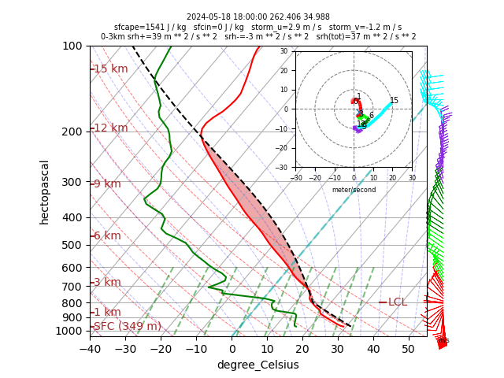

Requirements
* access to Campaign Storage `/glade/campaign/`
* Python modules in `environment.yml`

Average 4 nearest neighbors to create an ERA5 sounding for CM1.
```csh
python io.py --time 20240518T18 \
             --lat 35.0 \
             --lon -97.5 \
             --model_levels \
             --neighbors 4
```

Expected output
```txt
970.657265625 304.96840122539595 11.747593879699707
358.4174049017497 304.96840122539595 11.747594 -0.5483265 2.73069
380.54032965421084 304.6743645758991 11.498227 -0.68818283 3.4614773
404.708255386005 304.5535878745396 11.393301 -0.73482513 3.775196
431.08264653696324 304.47720570647425 11.329708 -0.7543106 3.9692726
459.8599989124849 304.42263681736296 11.283353 -0.76189995 4.1102505
491.260237960746 304.3810119697638 11.246566 -0.7610302 4.2205486
525.5182674313297 304.34785655045994 11.215036 -0.7530823 4.3127804
562.8836016857136 304.31938519027574 11.187205 -0.7418728 4.3923798
603.6127606960562 304.2954985190947 11.1609535 -0.72548294 4.4626694
647.9948621354241 304.27365604129596 11.136223 -0.7049713 4.5272045
696.3356964614975 304.2526852609789 11.11126 -0.67718124 4.5868816
[ middle of sounding truncated for display ]
51924.80412237601 2124.6908552742752 0.004016554 -14.470295 12.156921
53727.937826686764 2238.9303603700573 0.004010447 -12.600323 11.774208
55598.57132697673 2361.8045323717047 0.004006495 -12.546909 10.750179
57536.544184722305 2493.7872966109776 0.00402045 -14.150719 9.373539
59541.54177382454 2637.5698760101877 0.0040414864 -17.022324 7.7416534
61615.95080627604 2802.18396369304 0.0040442417 -22.197521 5.819565
63765.47510490099 2992.864331659829 0.004039855 -29.190674 4.0974274
65997.91030820494 3218.3798436168618 0.003858825 -33.905994 4.0924797
68319.63428062075 3475.1252194218564 0.0034611665 -35.155327 6.0078087
70727.930762076 3751.261940723118 0.002933567 -35.780502 5.6500416
73222.36684076797 4084.5031995531303 0.0024491388 -38.776955 2.3205833
78499.20293708336 5103.621596403739 0.001768994 -40.6935 -0.16107559
```

Plot a skew-T diagram.

```csh
python skewt.py --time 20240518T18 \
                --lat 35.0 \
                --lon -97.5 \
                --model_levels \
                --neighbors 4
```

Expected output


